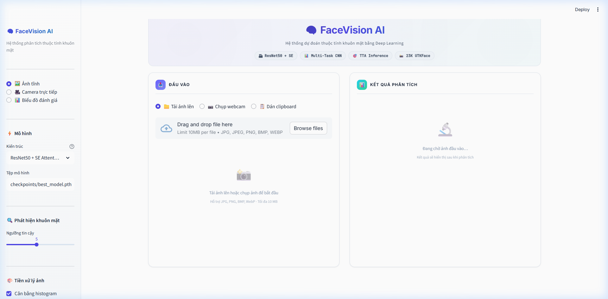
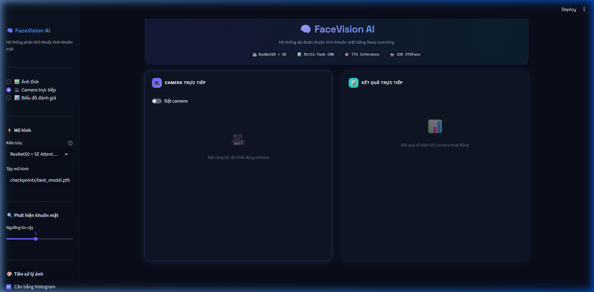
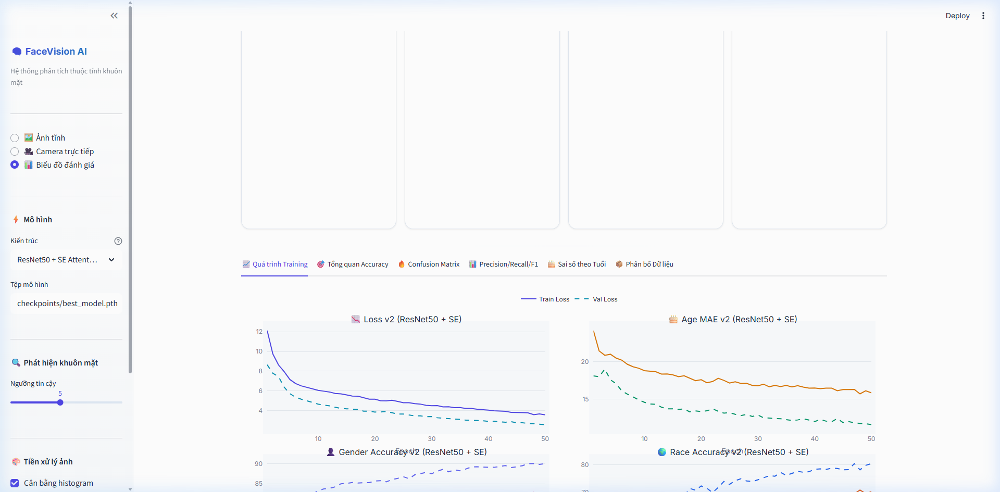

<p align="center">
  <h1 align="center">FaceVision AI</h1>
  <p align="center">
    <strong>Multi-Task Face Attribute Prediction — Age, Gender, Race</strong>
  </p>
  <p align="center">
    
    
    
    
    
    
  </p>
</p>

---

## Quick Start

```bash
# 1. Clone repo
git clone https://github.com/nvtd20112005/facevision-ai.git
cd facevision-ai

# 2. Cài thư viện
pip install -r requirements.txt

# 3. Chạy app (model đã train sẵn)
streamlit run app.py
```

> Yêu cầu: **Python 3.9+**, **CUDA 11.8+** (tùy chọn, hỗ trợ CPU). Xem chi tiết ở phần [Cài đặt](#cài-đặt-và-chạy).

---

## Giới thiệu

Hệ thống dự đoán thuộc tính khuôn mặt end-to-end: từ phát hiện khuôn mặt (MTCNN + Haar Cascade), qua pipeline xử lý ảnh số (CLAHE), đến dự đoán đa nhiệm (Age, Gender, Race) bằng **ResNet50 + SE Attention**, với giao diện web **Streamlit 3 chế độ** (ảnh tĩnh, camera trực tiếp, biểu đồ đánh giá).

| | Metric | Kết quả |
|---|---|---|
| 🎂 | **Age MAE** | **4.49 năm** |
| 👤 | **Gender Accuracy** | **93.53%** |
| 🌍 | **Race Accuracy** | **85.69%** |

---

## Screenshots

### Chế độ 1 — Dự đoán ảnh tĩnh

<p align="center">
  
</p>

### Chế độ 2 — Camera trực tiếp

<p align="center">
  
</p>

### Chế độ 3 — Biểu đồ đánh giá

<p align="center">
  
</p>

---

## Architecture

```
┌─────────────────────────────────────────────────────────────────┐
│                         INPUT LAYER                              │
│  Upload ảnh / Webcam / Clipboard ──► Streamlit app.py            │
└──────────────────────────┬──────────────────────────────────────┘
                           │
┌──────────────────────────▼──────────────────────────────────────┐
│                    DETECTION LAYER                                │
│  face_detector.py                                                │
│  ├─ MTCNN (primary) — P-Net → R-Net → O-Net                    │
│  └─ Haar Cascade (fallback) — ~5ms/frame cho live camera        │
└──────────────────────────┬──────────────────────────────────────┘
                           │
┌──────────────────────────▼──────────────────────────────────────┐
│                  PREPROCESSING LAYER (DIP)                        │
│  image_processing.py                                              │
│  ├─ Ensure RGB (Gray/RGBA/BGR → RGB)                             │
│  ├─ CLAHE histogram equalization (LAB color space)               │
│  ├─ Gaussian blur (optional)                                     │
│  └─ Resize 224×224                                               │
└──────────────────────────┬──────────────────────────────────────┘
                           │
┌──────────────────────────▼──────────────────────────────────────┐
│                    PREDICTION LAYER                                │
│  face_attribute_model.py + analyzer.py                            │
│  ├─ ResNet50 backbone (pretrained ImageNet)                      │
│  ├─ SE Attention (channel-wise, 2048-dim)                        │
│  ├─ Age head: FC(2048→512→128→1) regression                     │
│  ├─ Gender head: FC(2048→256→2)                                  │
│  ├─ Race head: FC(2048→256→4)                                    │
│  └─ TTA: 5 augmentations averaged (flip, brightness, rotate)    │
└─────────────────────────────────────────────────────────────────┘
```

---

## Tính năng

| | Tính năng | Chi tiết |
|---|---|---|
| 🧠 | **Multi-Task CNN** | ResNet50 + SE Attention, 3 heads đồng thời |
| 📸 | **3 chế độ** | Ảnh tĩnh · Camera trực tiếp · Biểu đồ đánh giá |
| 🔍 | **Face Detection** | MTCNN (primary) + Haar Cascade (fallback) |
| 🎨 | **DIP Pipeline** | CLAHE + Gaussian Blur + Resize |
| 🎯 | **TTA Inference** | 5 augmentations trung bình → tăng accuracy |
| ⚡ | **Batch Predict** | GPU batch processing cho multi-face |
| 📊 | **6 tab biểu đồ** | Training curves, Confusion Matrix, Radar, Age Error |
| 📥 | **Export CSV** | Xuất kết quả phân tích thành file CSV |
| 🎥 | **Live Camera** | Real-time ~15-25 FPS với Haar fast detect |

---

## Công nghệ

| Thành phần | Công nghệ | Vai trò |
|---|---|---|
| Deep Learning | **PyTorch 2.x** | Model + Training pipeline |
| Backbone | **ResNet50 + SE** | Feature extraction (ImageNet pretrained) |
| Loss | **WingLoss + FocalLoss** | Age regression + Race class imbalance |
| Detection | **MTCNN / Haar Cascade** | Face detection + crop |
| DIP | **OpenCV CLAHE** | Histogram equalization |
| Web | **Streamlit** | 3-mode reactive app |
| Charts | **Plotly** | Interactive evaluation charts |
| Dataset | **UTKFace (23K)** | Age/Gender/Race labels |

---

## Cấu trúc dự án

```
facevision-ai/
├── app.py                          # Streamlit UI (3 chế độ)
├── requirements.txt                # Python dependencies
├── LICENSE                         # MIT License
├── .gitignore
├── .editorconfig
├── .streamlit/config.toml          # Dark theme config
│
├── src/                            # Core source (6 modules)
│   ├── models/
│   │   └── face_attribute_model.py #   ResNet50 + SE + 3 heads
│   ├── data/
│   │   ├── dataset.py              #   UTKFaceDataset + Mixup
│   │   └── loader.py               #   Split + WeightedSampler
│   ├── losses/
│   │   └── multi_task_loss.py      #   WingLoss + FocalLoss + Uncertainty
│   ├── detection/
│   │   └── face_detector.py        #   MTCNN + Haar fallback
│   ├── inference/
│   │   └── analyzer.py             #   TTA + batch predict pipeline
│   ├── preprocessing/
│   │   └── image_processing.py     #   CLAHE + blur + resize
│   └── utils/
│       └── constants.py            #   Centralized config
│
├── scripts/                        # Training & evaluation
│   ├── train_v3.py                 #   Main training (50 epochs)
│   ├── eval.py                     #   Test set evaluation
│   ├── export_charts.py            #   Chart generation
│   └── organize_data.py            #   Dataset organization
│
├── checkpoints/
│   └── best_model.pth              # Trained model (100MB)
│
├── data/                           # Dataset (download required)
│   ├── labels.csv                  #   Full labels (23K rows)
│   ├── train.csv / val.csv / test.csv
│   └── README.md                   #   Dataset documentation
│
├── notebooks/
│   └── train_colab.ipynb           # Google Colab training
│
├── chart/                          # Exported training charts
│   ├── 01-13_*.png                 #   Model metrics
│   └── data/01-08_*.png            #   Dataset distribution
│
├── logs/
│   └── metrics.json                # Training & test metrics
│
└── docs/
    ├── PROJECT_STRUCTURE.md
    └── screenshots/
```

---

## Cài đặt và chạy

### Yêu cầu

| | Tối thiểu |
|---|---|
| Python | 3.9+ |
| GPU | CUDA 11.8+ (tùy chọn, hỗ trợ CPU) |
| RAM | 4 GB (khuyến nghị 8 GB) |
| Disk | ~500 MB (model + charts) |

### Bước 1 · Cài thư viện

```bash
pip install -r requirements.txt
```

### Bước 2 · Tải dataset (tùy chọn, chỉ cần khi train lại)

Tải [UTKFace dataset](https://susanqq.github.io/UTKFace/) (~200MB) vào `data/raw/UTKFace/`.

```bash
python scripts/organize_data.py
```

### Bước 3 · Chạy app

Model đã train sẵn — chạy demo ngay:

```bash
streamlit run app.py
```

Mở **http://localhost:8501**

### (Tùy chọn) Train lại model

```bash
python scripts/train_v3.py          # ~2-4 giờ (GPU)
python scripts/train_v3.py --resume # Tiếp tục từ checkpoint
```

---

## Training Pipeline

### Kỹ thuật huấn luyện

| # | Kỹ thuật | Chi tiết | Ý nghĩa |
|---|---|---|---|
| 1 | **Freeze → Unfreeze** | 5 epochs freeze backbone → differential LR | Bảo toàn pretrained, tránh Catastrophic Forgetting |
| 2 | **Wing Loss** | Thiết kế cho face regression (thay SmoothL1) | Nhạy với sai số nhỏ (0-5 tuổi) |
| 3 | **Focal Loss** | Giảm bias cho minority race classes | Tập trung học mẫu khó, lớp thiểu số |
| 4 | **Uncertainty Weighting** | Tự học task weights (Kendall et al.) | Tự cân bằng 3 task theo độ khó |
| 5 | **Gradient Accumulation** | Effective batch = 128 (32 × 4) | Mô phỏng batch lớn trên GPU nhỏ |
| 6 | **Mixup** | α=0.2, 70% batches | Trộn ảnh thiểu số, chống overfitting |
| 7 | **Progressive Resizing** | 160 → 192 → 224 pixels | Khởi động nhanh, tinh chỉnh ở ảnh lớn |
| 8 | **WeightedRandomSampler** | Cân bằng Race + Age group | Cân bằng lấy mẫu nhóm thiểu số |
| 9 | **Early Stopping** | patience=10 epochs | Ngưng train khi hết cải thiện |

### Kết quả đánh giá (Test Set — 3,556 mẫu)

| Metric | Value |
|--------|-------|
| Age MAE | 4.49 năm |
| Age ≤5 năm | 65.7% |
| Age ≤10 năm | 87.4% |
| Gender Accuracy | 93.53% |
| Race Accuracy | 85.69% |

### Sai số tuổi theo nhóm

```
0-12  Child       ██ 1.67 năm  — Xuất sắc
13-19 Teen        ████ 3.64 năm
20-35 Young Adult ████ 3.77 năm
36-55 Adult       ███████ 6.68 năm
56+   Senior      █████████ 8.44 năm
```

---

## Feature Importance

14 engineered features từ pipeline xử lý:

| # | Feature | Nguồn |
|---|---------|-------|
| 1 | Face crop | MTCNN bounding box + 40% margin |
| 2 | CLAHE equalization | LAB L-channel histogram |
| 3 | RGB normalization | ImageNet mean/std |
| 4 | SE attention | Channel-wise 2048-dim weighting |
| 5 | TTA (5 views) | Flip, brightness ±10%, rotate 5° |

---

## Tài liệu tham khảo

- [UTKFace Dataset](https://susanqq.github.io/UTKFace/) — Large Scale Face Dataset
- [ResNet (He et al., 2016)](https://arxiv.org/abs/1512.03385)
- [SE-Net (Hu et al., 2018)](https://arxiv.org/abs/1709.01507) — Squeeze-and-Excitation Networks
- [Wing Loss (Feng et al., 2018)](https://arxiv.org/abs/1711.06753) — Face Alignment
- [Multi-Task Uncertainty Weighting (Kendall et al., 2018)](https://arxiv.org/abs/1705.07115)
- [Focal Loss (Lin et al., 2017)](https://arxiv.org/abs/1708.02002)
- [MTCNN (Zhang et al., 2016)](https://arxiv.org/abs/1604.02878) — Face Detection

---

## License

[MIT](LICENSE) © 2026 Nguyễn Văn Tùng Dương
